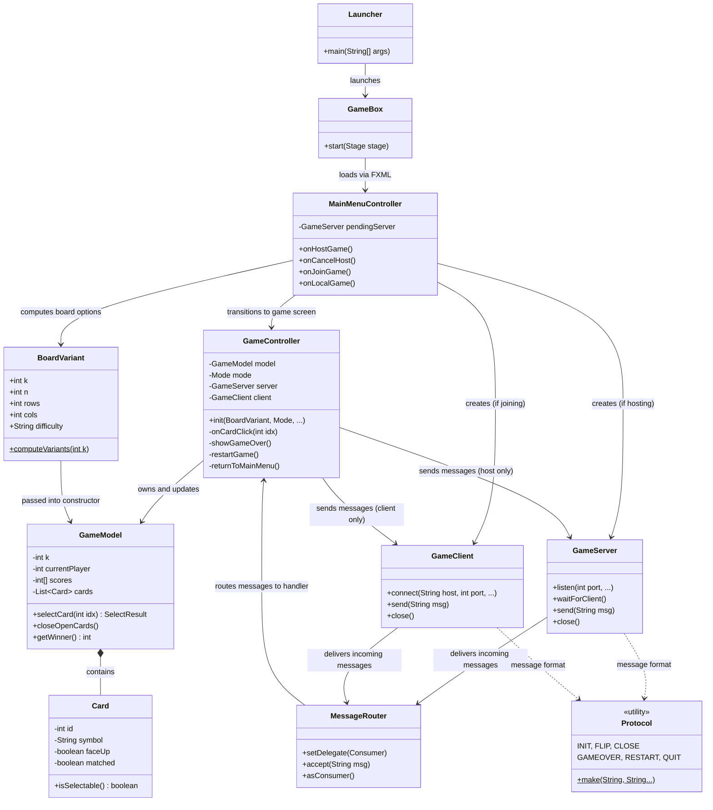

# Architecture – Multi Match Memory Game

**Team:** Zero Runtime Warranty

---

## Project Structure

The project follows the **MVC (Model-View-Controller)** pattern and is split into three main packages:

- **`model`** — pure game logic, no UI or network dependencies
- **`controller`** — JavaFX UI controllers that wire the model to the view
- **`network`** — TCP socket classes for LAN multiplayer

---

## Class Diagram

---

## How the Network Game Works

1. **Host** clicks "Host Network Game" → `GameServer` opens a TCP socket on port `54321` and waits for a connection.
2. **Client** enters the host IP and clicks "Connect" → `GameClient` connects to that socket.
3. Both players are placed into the `GameController`. The host creates a `GameModel` and sends an `INIT` message to the client with the full shuffled card layout.
4. During play, every card click is sent as a `FLIP` message. The **host is the single source of truth** — it validates the move and broadcasts the result to the client.
5. A mismatch triggers a short pause, then a `CLOSE` message tells the client to flip the cards back and switch turns.
6. When all cards are matched, the host sends `GAMEOVER`. Either player can then request `RESTART` or send `QUIT` to return to the main menu.

---

## Network Protocol

All messages are plain text lines sent over TCP (port **54321**).

| Message | Sent by | Description |
| :--- | :--- | :--- |
| `INIT` | Host | Full board layout sent to client at game start |
| `FLIP` | Both | A card was flipped |
| `CLOSE` | Host | Mismatch — flip cards back and switch turn |
| `GAMEOVER` | Host | Game finished; includes winner (`0`, `1`, or `-1` for draw) and scores |
| `RESTART` | Both | Request a new game with the same settings |
| `QUIT` | Both | Player is leaving and returning to main menu |
